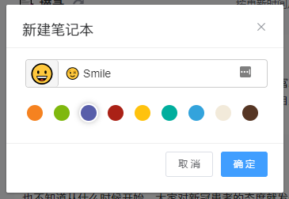
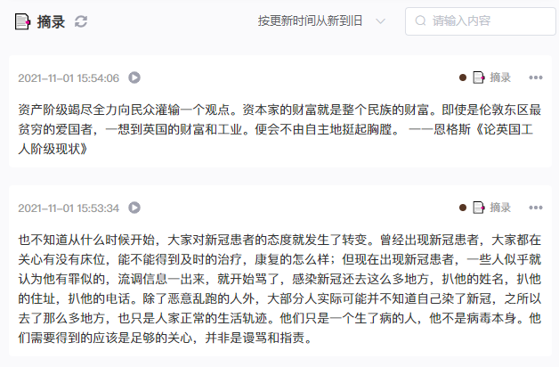
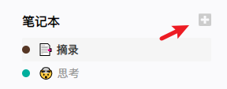
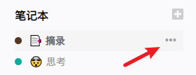
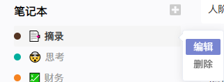
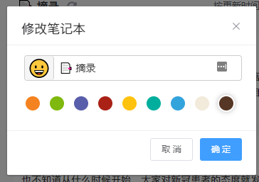
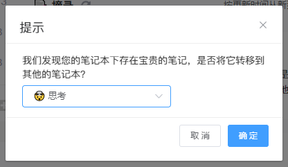

## 笔记本

在方寸笔迹中，所有的笔记都会默认记录到笔记本中。每个笔记本都可视为一个知识仓库，包含了你在日常中所有相关的知识以及思考的笔记。

创建笔记本时，你可以使用颜色来标记笔记本所归属的类型，比如红色作为工作相关的笔记本、蓝色作为学习相关的笔记本等...你的笔记本的显示就更加直观，一目了然。同时，你也可以选择你喜欢的emoji作为笔记本的名称，便于视觉性的识别。

在选中某个笔记本之后，就会切换到相应的知识仓库，会默认按照增加笔记的时间由近及远地展示你所记录的笔记。

#### web端如何创建一个笔记本

在界面的左侧，找到`笔记本`，然后点击旁边的`+`，就会弹出一个输入基础信息的弹窗。

#### web端如何修改笔记本信息

定位到你刚刚创建的笔记本，鼠标移上去之后，右侧会出现`...`，点击`...`就会出现编辑选项，点击`编辑`，就会弹出跟创建时一样的弹窗，默认已经显示需要修改的笔记本信息，跟创建时一样，将你要修改的信息设置到对应位置，点击保存即可。

#### web端如何删除我的笔记本

删除是一个敏感操作，特别是在笔记本下存在笔记的情况下。因此方寸笔迹提供了删除的二次确认。

当你选择删除时，会提示你是要删除笔记还是将笔记移动到其他笔记本中。删除笔记，会将笔记本下的笔记全部移到废纸篓中。移动笔记则会把全部笔记移动到选择的笔记本中。当笔记得到妥善处理后，方能删除笔记本。

