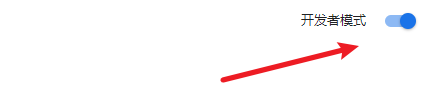
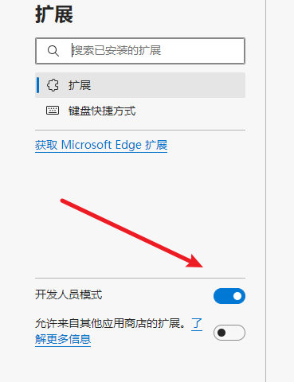

## 浏览器插件


方寸笔迹提供了浏览器端选中文字或图片一键保存的功能，便于你在阅读过程中不打断你的阅读状态，更快速地记录笔记。

目前插件适应谷歌（Chrome）、Edge浏览器，对于其他浏览器的兼容性仍有待进一步验证。


### 谷歌(Chrome)浏览器安装方法

**第一步**

在浏览器地址栏输入：

```html
chrome://extensions/
```

摁下回车键后，会打开浏览器插件界面

**第二步**

在右上角找到**开发者模式**，确保是开启状态。





**第三步**

将你刚刚下载好的crx插件直接拖到界面内，按照提示，就可以正常安装。


### Edge浏览器安装方法

**第一步**

在浏览器地址栏输入：

```html
edge://extensions/
```

打开插件浏览器的管理界面。


**第二步**

找到左侧偏下方部分，确保**开发者人员模式**是开启的。




**第三步**

同Chrome浏览器一样，将crx文件拖入，按照操作提示就可以安装。


### 使用方法

点击打开插件，用自己的方寸笔迹账户信息登入。

[](https://imgtu.com/i/TQXESx)

登入之后，需要刷新当前页面，或者打开新的网页界面。就可以实现对网页中的任意文字、图片右键保存到方寸笔迹中。

[](https://imgtu.com/i/TQqpeH)

[](https://imgtu.com/i/TQqvhq)