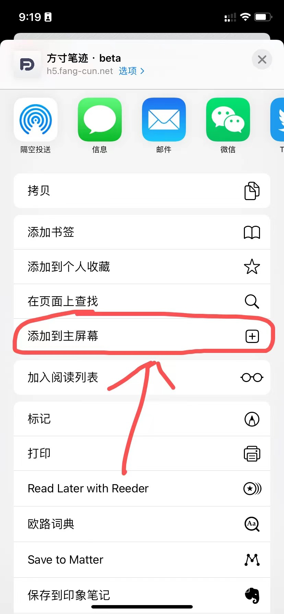

## 移动版

现在，你可以在移动设备上通过移动浏览器的来使用方寸笔迹。移动版主要是以笔记的浏览和快速记录为主，屏蔽了其他非必要的功能。被移动版屏蔽的其他功能，你可以移步到[web端](https://fangcun.in)来使用。

扫下方二维码可以快速体验方寸笔迹移动版。

*目前移动版还处于beta版本，我们会近期尽快收集问题并摘掉beta的帽子，欢迎向我们反馈问题：cuimengchao@fang-cun.net*

### 微信与移动浏览器

在微信环境中，你可以使用微信登录的方式，直接登录方寸笔迹。如果你的账户没有绑定微信，可以在移动版选择用账户密码登录，登录成功会直接绑定微信，下次就可以使用微信一键登录。

而在移动浏览器中使用，目前只能使用账户密码登录，你不用担心每次都需要登录，我们在你的设备中保留了30天的有效周期，一次性登录30天可免登录使用。

你可以把方寸笔迹移动版添加到手机主屏幕中，不会像App一样需要下载占用手机空间，只需要打开时默认加载一些网络资源，就能很方便地使用。

### 笔记卡片图

在H5端由于对文字复制的不便捷，方寸笔迹提供笔记转图片功能。

你可以双击对应笔记，就会弹出图片格式的笔记，方便你分享和复制。

### iOS添加到主屏幕

以iOS 15为例。

1️⃣ 第一步，使用**Safari**打开[方寸笔迹移动版](https://h5.fang-cun.net/)，找到底部的**分享**按钮

2️⃣ 第二步，在分享的弹出中找到**添加到主屏幕**一项，并选择。

3️⃣ 第三步，确认添加到主屏幕，这里你可以把标题改成任何自己喜欢的名字。

4️⃣ 这时就已经出现在手机主界面了，你可以更便捷地体验方寸笔迹移动版。

### Android 添加到主屏幕

由于Android的定制化程度比较高，这里以**华为**系统为例，对于其他机型有普遍的借鉴意义。

1️⃣ 第一步，使用系统自带浏览器打开[方寸笔迹移动版](https://h5.fang-cun.net/)，在底部找到菜单

2️⃣ 第二步，从弹出的菜单中找到**添加至**，并选择

3️⃣ 第三步，确认添加到桌面，同样标题你可以改成自己喜欢的名字。

4️⃣ 这时就已经添加到主屏幕了。

