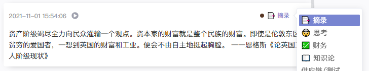
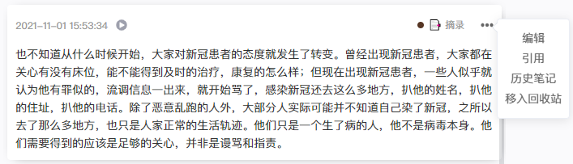
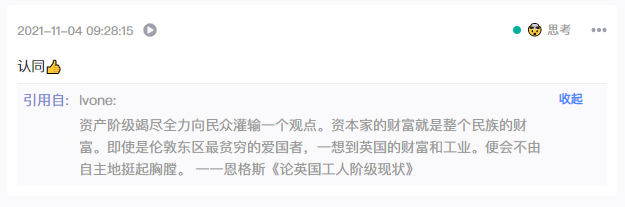

### 笔记

在你输入内容后保存，就会产生一条笔记。这条笔记在记录下来之后，就会被系统自动进行分词处理，并通过严格的保密方式永久地记录在数据库中。

笔记默认会带有[笔记本](./collection.md)属性，是笔记所归属的[笔记本](./collection.md)，也就是笔记中知识的归类处理。可以通过点击笔记右上方的笔记本属性，可以便捷地切换到其他的[笔记本](./collection.md)，或是点开编辑来修改对应的[笔记本](./collection.md)。

笔记的[标签](./tag.md)索引属性是选择性属性，笔记不一定必须要有知识关键词。如果你想添加或是删除笔记关键词，可以在编辑时进行添加和修改。

笔记在记录后，倘若你发现不够稳妥，我们提供笔记的修改功能。找到你要修改的笔记右上角的`...`符号找到编辑，或者**双击**笔记内容，就能变为[文本编辑器](./editor.md)，修改后可直接保存。

对于已经记录的笔记，如果你有新的见解和思考，可以通过引用的方式来新建笔记，形成两篇笔记之间的关联。

笔记之间的引用是笔记直接知识联结的最好方式。

