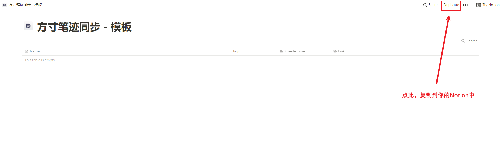
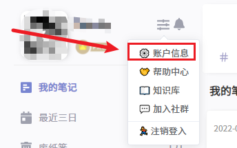
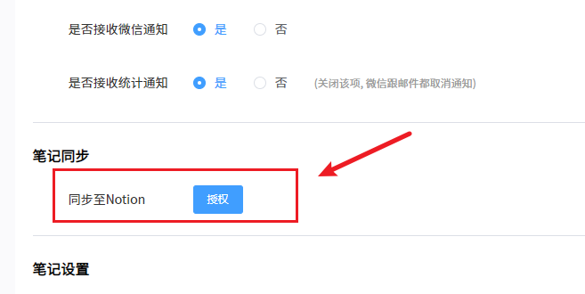
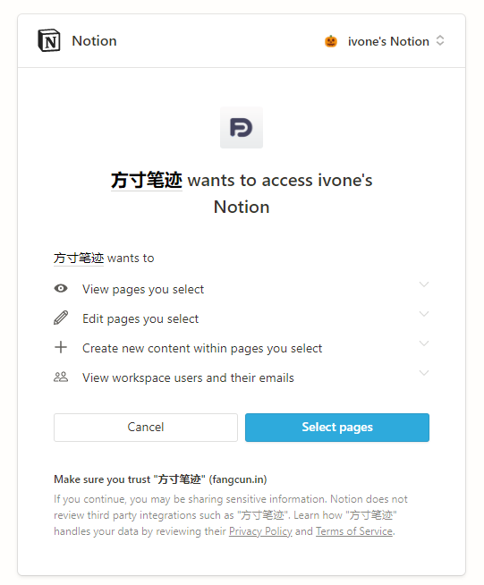
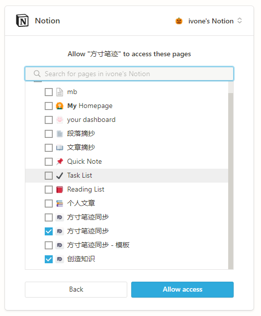
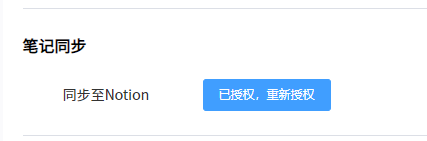
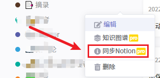
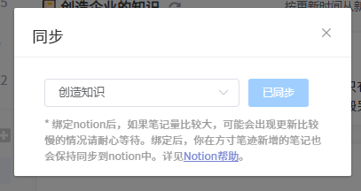
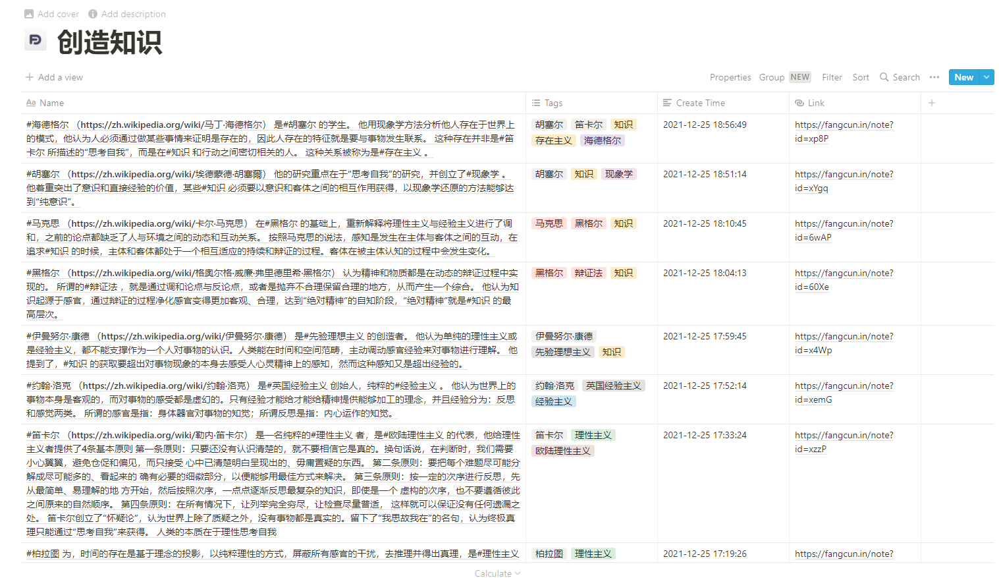

### Notion同步

注意：[Notion官方API](https://developers.notion.com/)仍处于beta版本，因此可能会出现一定程度的不稳定波动。


如果你习惯在Notion中管理笔记，我们基于Notion官方提供的API开发了方寸笔迹与Notion的实时同步功能，你可以使用方寸笔迹中喜欢的功能，同时在方寸笔迹中新增的笔记，也会实时同步到Notion中。

*目前Notion仅提供非历史笔记的同步，对笔记的修改，也会作为一条新笔记同步到Notion中。*


方寸笔迹与Notion的同步，目前是基于笔记本的同步，而非全量笔记的同步，在同步前需要笔记本绑定对应同步的目标Notion笔记。

以下是Notion同步的步骤说明，略有繁琐，但并不困难，设定后可一劳永逸。


**1️⃣ 第一步**

登录[网页版Notion](https://www.notion.so/zh-cn)，将方寸笔迹官方提供的[模板](https://boom-neon-09c.notion.site/655f3380e64a4fe098fc8d27fd68e4b3?v=a459b7d92f794ab085ee758f80f348c8)，复制到你的Notion笔记库中，并且可以重新命名为你喜欢的名字。

```http
https://boom-neon-09c.notion.site/655f3380e64a4fe098fc8d27fd68e4b3?v=a459b7d92f794ab085ee758f80f348c8
```



如果你想同步多个笔记本，可以复制多个模板到你的Notion中，并且命名为你需要的名字。

请注意，此模板是按照方寸笔迹导出的结构进行设置的，请不要在此模板上增加其他字段，避免出现不可预知的同步问题。


**2️⃣ 第二步**

在方寸笔迹 - 账户信息中，找到授权Notion的按钮，并点击。






点击后，会跳转到Notion的授权页面



选择`Select Pages`



选择你想授权的笔记本（可多选），然后点击`Allow access`。


**3️⃣ 第三步**

第二步操作结束后，会跳转回方寸笔迹的账户中心界面，方寸笔迹可能要花几秒钟时间来与Notion通信，产生与Notion笔记本的绑定关系，绑定成功后会有提示。




**4️⃣ 第四步**

回到笔记的主界面，找到你想同步的笔记本，选择`同步Notion`






**🎉🎉 完成**

笔记现在已经在同步的进程中了，可能会有些许延迟，请耐心等待~



后续在已经同步的笔记本中增加笔记，都会实时同步到Notion中。如果你想增加同步的笔记本，可以在账户信息中重新授权notion，在授权时增加要同步的笔记本，方寸笔迹就能同步啦。

请放心使用，如有问题和建议，可以加群联系我们。


