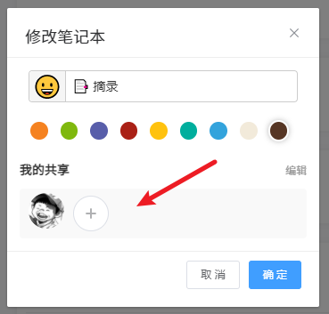
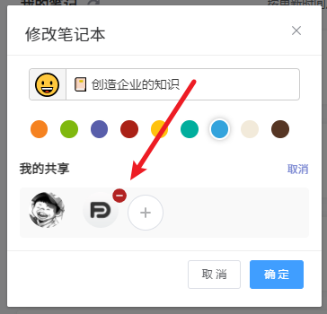

## 团队版

方寸笔迹提供多用户共用一个[笔记本](./collection.md)的信息共享方式，笔记记录的方法不变，只是笔记本中增加了共享笔记的呈现，你可以引用他人的笔记进行补充，同时共享笔记本中的[标签](./tag.md)也会显示在自己的标签组中。

### 权限

在新成员加入后，新成员有权给笔记本增加笔记内容和引用成员的笔记；笔记本的创建者有权对共享笔记成员移除，移除后笔记本笔记对移除用户不可见，但用户的笔记内容保留。

### 如何邀请成员？

在笔记本编辑中，可以邀请好友加入

点击后会弹出一个加入二维码，被邀请者用微信扫码关注公众号之后，即可加入到共享的团队笔记本中。

### 如何移除成员？

点击成员右上角的移除按钮，即可把成员移除。

