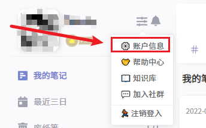
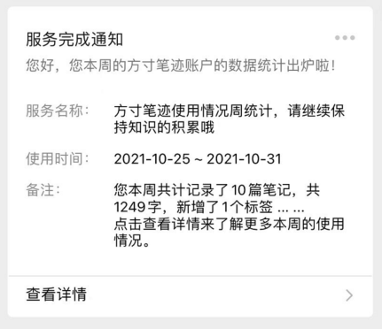

## 微信

方寸笔迹绑定微信后，可以实现使用量统计推送、微信笔记的录入等功能。

### 绑定微信

在你的[账户设置](./setting.md)中，找到绑定微信的按钮。

扫码关注方寸笔迹公众号之后，就实现了微信与方寸笔迹账户的打通。

### 微信录入

扫码关注我们的公众号之后，就能实现微信账户与方寸笔迹账户的有效打通，后面的笔记都能实现无缝对接，便于你更便捷地管理和记录[笔记](./note.md)。

在账户绑定完成后，你通过微信发送的所有文字、图片、语音，都会被记录到你的笔记系统中。

以及通知的消息，也会通过微信进行通知。

